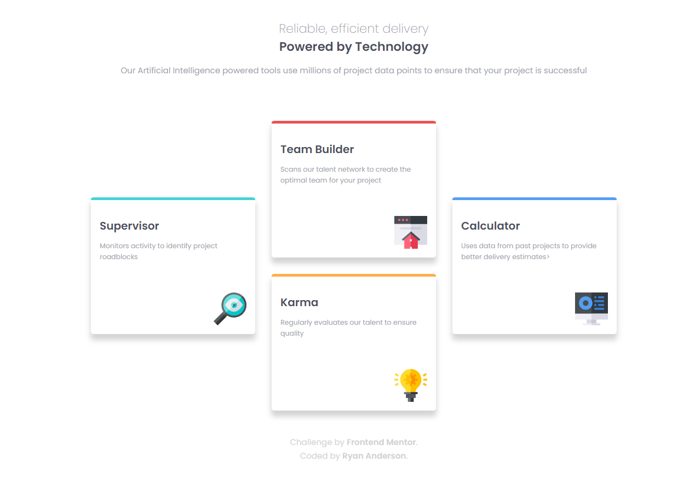

# Frontend Mentor - Four card feature section solution

This is a solution to the [Four card feature section challenge on Frontend Mentor](https://www.frontendmentor.io/challenges/four-card-feature-section-weK1eFYK). Frontend Mentor challenges help you improve your coding skills by building realistic projects.

## Table of contents

- [Overview](#overview)
  - [The challenge](#the-challenge)
  - [Screenshot](#screenshot)
  - [Links](#links)
- [My process](#my-process)
  - [Built with](#built-with)
  - [What I learned](#what-i-learned)
  - [Continued development](#continued-development)
  - [Useful resources](#useful-resources)
- [Author](#author)

## Overview

### The challenge

Users should be able to:

- View the optimal layout for the site depending on their device's screen size

### Screenshot



### Links

- Solution URL: [Solution](https://www.frontendmentor.io/solutions/fourcardfeature-html-css-and-flexbox-TnVWU4hob)
- Live Site URL: [live site](https://ando96.github.io/Four-card-feature-section/)

## My process

### Built with

- Semantic HTML5 markup
- CSS custom properties
- Flexbox

### What I learned

Still using flexbox

```css
.container {
  display: flex;
}
```

### Continued development

At first I didn't really know how to tackle the card layout but once I realised it could all be done with flexbox it all started to make sense. I will continue to work on my HTML and CSS skills working through
these challenges.

### Useful resources

- [w3schools] https://www.w3schools.com/css/default.asp - Has everything you need when it comes to HTML and CSS basics
- [MDN] https://developer.mozilla.org/en-US/- Has a lot of useful and interesting information about the different HTML and CSS tags, I find a new attribute or tag every time I'm looking for something

## Author

- Frontend Mentor - [@Ando96](https://www.frontendmentor.io/profile/Ando96)
